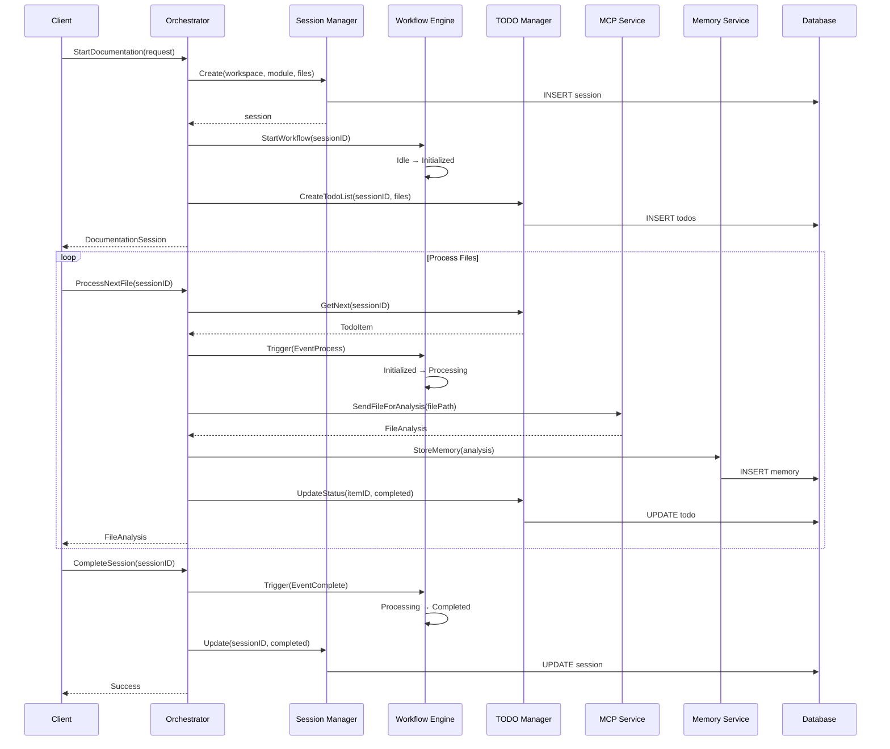

# T10: Documentation

## Overview
Create comprehensive documentation for the orchestrator including API documentation, sequence diagrams for workflows, and configuration options. The documentation should be clear, complete, and follow godoc conventions.

## Objectives
1. Write API documentation for orchestrator
2. Create sequence diagrams for workflows
3. Document configuration options
4. Generate godoc-compatible comments
5. Create developer guide

## Technical Approach

### 1. Package Documentation

```go
// Package orchestrator provides the core documentation workflow orchestration system.
//
// The orchestrator manages the entire lifecycle of documentation generation, from
// session creation through file processing to final documentation output. It coordinates
// between various services including the MCP handler, file system service, and
// memory system.
//
// Architecture Overview
//
// The orchestrator follows a layered architecture:
//
//	┌─────────────────────────────────────────┐
//	│            MCP Interface                 │
//	├─────────────────────────────────────────┤
//	│         Orchestrator Core               │
//	│  ┌─────────┐ ┌──────────┐ ┌─────────┐ │
//	│  │Session  │ │Workflow  │ │TODO List│ │
//	│  │Manager  │ │Engine    │ │Manager  │ │
//	│  └─────────┘ └──────────┘ └─────────┘ │
//	├─────────────────────────────────────────┤
//	│         Service Layer                   │
//	│  ┌─────────┐ ┌──────────┐ ┌─────────┐ │
//	│  │MCP      │ │FileSystem│ │Memory   │ │
//	│  │Service  │ │Service   │ │Service  │ │
//	│  └─────────┘ └──────────┘ └─────────┘ │
//	├─────────────────────────────────────────┤
//	│         Data Layer                      │
//	│  ┌─────────────────────────────────┐   │
//	│  │       PostgreSQL Database       │   │
//	│  └─────────────────────────────────┘   │
//	└─────────────────────────────────────────┘
//
// Basic Usage
//
//	// Create orchestrator
//	config := orchestrator.LoadConfig("config.yaml")
//	orch, err := orchestrator.New(config)
//	if err != nil {
//	    log.Fatal(err)
//	}
//	defer orch.Stop()
//
//	// Start documentation session
//	req := orchestrator.DocumentationRequest{
//	    WorkspaceID: "my-project",
//	    ModuleName:  "authentication",
//	    FilePaths:   []string{"/src/auth/*.go"},
//	}
//	session, err := orch.StartDocumentation(ctx, req)
//	if err != nil {
//	    log.Fatal(err)
//	}
//
//	// Process files
//	for {
//	    analysis, err := orch.ProcessNextFile(ctx, session.ID)
//	    if err == orchestrator.ErrNoMoreFiles {
//	        break
//	    }
//	    if err != nil {
//	        log.Error(err)
//	        continue
//	    }
//	    log.Info("Processed:", analysis.FilePath)
//	}
//
// Configuration
//
// The orchestrator can be configured via YAML file or environment variables:
//
//	database:
//	  host: localhost
//	  port: 5432
//	  database: codedoc
//	  user: codedoc_user
//	  password: ${DB_PASSWORD}
//	
//	session:
//	  default_ttl: 2h
//	  max_sessions: 100
//	  cleanup_interval: 5m
//	
//	services:
//	  mcp:
//	    endpoint: localhost:8080
//	    timeout: 30s
//	  filesystem:
//	    workspace_root: /workspace
//	    max_file_size: 10MB
//
package orchestrator
```

### 2. API Documentation

```go
// orchestrator.go

// Orchestrator manages the documentation generation workflow.
// It coordinates between various services to process files and generate documentation.
type Orchestrator interface {
    // StartDocumentation initiates a new documentation session.
    //
    // The method creates a new session with the provided configuration and
    // prepares the workflow for processing. It returns a session object that
    // can be used to track progress and retrieve results.
    //
    // Example:
    //
    //	req := DocumentationRequest{
    //	    WorkspaceID: "my-project",
    //	    ModuleName:  "core-api",
    //	    FilePaths:   []string{"/api/handlers/*.go", "/api/models/*.go"},
    //	    Options: DocumentationOptions{
    //	        IncludeTests: false,
    //	        MaxFileSize:  1024 * 1024, // 1MB
    //	    },
    //	}
    //	session, err := orch.StartDocumentation(ctx, req)
    //
    // Returns:
    //   - *DocumentationSession: The created session
    //   - error: ErrInvalidRequest, ErrWorkspaceNotFound, or internal errors
    StartDocumentation(ctx context.Context, req DocumentationRequest) (*DocumentationSession, error)
    
    // GetSession retrieves an existing documentation session by ID.
    //
    // This method returns the current state of a session including progress,
    // status, and any errors encountered during processing.
    //
    // Returns:
    //   - *DocumentationSession: The requested session
    //   - error: ErrSessionNotFound if the session doesn't exist
    GetSession(ctx context.Context, sessionID string) (*DocumentationSession, error)
    
    // ProcessNextFile processes the next file in the TODO queue.
    //
    // This method retrieves the next pending file from the session's TODO list,
    // sends it for AI analysis, and stores the results. It should be called
    // repeatedly until it returns ErrNoMoreFiles.
    //
    // The method handles:
    //   - Priority-based file selection
    //   - Retry logic for failed files
    //   - Progress tracking
    //   - Error recovery
    //
    // Returns:
    //   - *FileAnalysis: Analysis results for the processed file
    //   - error: ErrNoMoreFiles when queue is empty, or processing errors
    ProcessNextFile(ctx context.Context, sessionID string) (*FileAnalysis, error)
    
    // CompleteSession marks a documentation session as complete.
    //
    // This method should be called after all files have been processed. It
    // triggers final documentation generation and cleanup tasks.
    //
    // Returns:
    //   - error: ErrSessionNotFound or completion errors
    CompleteSession(ctx context.Context, sessionID string) error
}

// DocumentationRequest configures a new documentation session.
type DocumentationRequest struct {
    // WorkspaceID identifies the project workspace.
    // This should match a configured workspace in the system.
    WorkspaceID string `json:"workspace_id" validate:"required"`
    
    // ModuleName is a logical name for the component being documented.
    // Examples: "authentication", "payment-processing", "user-management"
    ModuleName string `json:"module_name" validate:"required"`
    
    // FilePaths lists the files to document.
    // Supports glob patterns like "/src/**/*.go"
    FilePaths []string `json:"file_paths" validate:"required,min=1"`
    
    // Options provides additional configuration for the session.
    Options DocumentationOptions `json:"options,omitempty"`
}
```

### 3. Workflow Sequence Diagrams



### 4. Configuration Documentation

```yaml
# config/orchestrator.yaml
# CodeDoc Orchestrator Configuration Reference

# Database configuration
database:
  # PostgreSQL host (default: localhost)
  host: ${DB_HOST:localhost}
  
  # PostgreSQL port (default: 5432)
  port: ${DB_PORT:5432}
  
  # Database name (required)
  database: codedoc
  
  # Database user (required)
  user: ${DB_USER:codedoc}
  
  # Database password (required, use environment variable)
  password: ${DB_PASSWORD}
  
  # SSL mode: disable, require, verify-ca, verify-full (default: require)
  ssl_mode: ${DB_SSL_MODE:require}
  
  # Connection pool settings
  max_open_conns: 25      # Maximum open connections
  max_idle_conns: 5       # Maximum idle connections
  conn_max_lifetime: 5m   # Maximum connection lifetime

# Session management configuration
session:
  # Default session time-to-live (default: 2h)
  # Formats: 1h30m, 90m, 5400s
  default_ttl: 2h
  
  # Maximum concurrent sessions (default: 100)
  max_sessions: 100
  
  # Session cleanup interval (default: 5m)
  cleanup_interval: 5m

# Workflow configuration
workflow:
  # Maximum retry attempts for failed states (default: 3)
  max_retries: 3
  
  # State timeout settings
  timeouts:
    initialization: 30s
    processing: 5m
    completion: 1m

# Service configurations
services:
  # MCP service settings
  mcp:
    # Service endpoint
    endpoint: ${MCP_ENDPOINT:localhost:8080}
    
    # Request timeout (default: 30s)
    timeout: 30s
    
    # Maximum concurrent requests
    max_concurrent: 10
    
    # Retry configuration
    retry:
      max_attempts: 3
      initial_delay: 1s
      max_delay: 30s
      multiplier: 2
  
  # File system service settings
  filesystem:
    # Workspace root directory
    workspace_root: ${WORKSPACE_ROOT:/workspace}
    
    # Maximum file size to process (default: 10MB)
    max_file_size: 10MB
    
    # Allowed file extensions
    allowed_extensions:
      - .go
      - .js
      - .ts
      - .py
      - .java
      - .rs
    
    # Excluded paths (glob patterns)
    exclude_patterns:
      - "**/node_modules/**"
      - "**/vendor/**"
      - "**/.git/**"
      - "**/dist/**"
      - "**/build/**"
  
  # Memory service settings
  memory:
    # Vector database endpoint
    endpoint: ${MEMORY_ENDPOINT:localhost:8081}
    
    # Embedding model
    embedding_model: "text-embedding-ada-002"
    
    # Memory evolution settings
    evolution:
      enabled: true
      interval: 24h
      batch_size: 100

# Logging configuration
logging:
  # Log level: debug, info, warn, error (default: info)
  level: ${LOG_LEVEL:info}
  
  # Log format: json, console (default: json)
  format: ${LOG_FORMAT:json}
  
  # Log output: stdout, stderr, or file path (default: stdout)
  output: stdout
  
  # Time format (default: RFC3339)
  time_format: "2006-01-02T15:04:05.000Z07:00"
  
  # Enable sampling for high-frequency logs
  sampling: true

# Monitoring configuration
monitoring:
  # Metrics endpoint
  metrics_endpoint: :9090/metrics
  
  # Health check endpoint
  health_endpoint: :9090/health
  
  # Enable pprof profiling endpoints
  enable_pprof: false
```

### 5. Developer Guide

```markdown
# CodeDoc Orchestrator Developer Guide

## Overview

The CodeDoc Orchestrator is the core component that manages documentation generation workflows. This guide covers the architecture, key concepts, and development practices.

## Architecture

### Components

1. **Session Manager**: Manages documentation session lifecycle
   - Creates and tracks sessions
   - Handles expiration
   - Maintains in-memory cache with database sync

2. **Workflow Engine**: Implements state machine for documentation flow
   - Manages state transitions
   - Executes state handlers
   - Provides rollback on failures

3. **TODO Manager**: Manages file processing queue
   - Priority-based scheduling
   - Retry logic
   - Progress tracking

4. **Service Registry**: Manages external service connections
   - Service lifecycle management
   - Health monitoring
   - Dependency injection

### Key Patterns

#### Dependency Injection
```go
container := orchestrator.NewContainer()
container.Register("session", sessionManager)
container.Register("workflow", workflowEngine)
container.Register("todo", todoManager)
```

#### Error Handling
```go
err := orchestrator.ProcessFile(ctx, file)
if coded, ok := err.(errors.CodedError); ok {
    log.Error().
        Str("code", coded.Code()).
        Str("category", string(coded.Category())).
        Msg("processing failed")
    
    // Use recovery hints
    for _, hint := range coded.RecoveryHints() {
        log.Info().Str("hint", hint).Msg("recovery suggestion")
    }
}
```

#### Instrumentation
```go
func ProcessFileWithMetrics(ctx context.Context, file string) error {
    return middleware.InstrumentedOperation(
        ctx,
        "process_file",
        map[string]string{"file_type": "go"},
        func() error {
            return processFile(ctx, file)
        },
    )
}
```

## Development Workflow

### Adding a New Service

1. Define the interface:
```go
type MyService interface {
    services.Service
    DoSomething(ctx context.Context) error
}
```

2. Implement the service:
```go
type myServiceImpl struct {
    config Config
}

func (s *myServiceImpl) Start(ctx context.Context) error {
    // Initialize resources
    return nil
}

func (s *myServiceImpl) Stop(ctx context.Context) error {
    // Cleanup resources
    return nil
}

func (s *myServiceImpl) HealthCheck(ctx context.Context) error {
    // Check service health
    return nil
}

func (s *myServiceImpl) Name() string {
    return "my-service"
}
```

3. Register with orchestrator:
```go
registry.Register(myService)
```

### Testing

#### Unit Tests
```go
func TestMyComponent(t *testing.T) {
    // Use test helpers
    ctx := testutil.TestContext(t)
    logger := testutil.TestLogger(t)
    
    // Create component
    component := NewComponent(logger)
    
    // Test behavior
    result, err := component.DoSomething(ctx)
    require.NoError(t, err)
    assert.Equal(t, expected, result)
}
```

#### Integration Tests
```go
func TestIntegration(t *testing.T) {
    // Setup test environment
    db := testutil.SetupTestDB(t)
    defer testutil.CleanupDB(t, db)
    
    // Create orchestrator
    orch := testutil.CreateTestOrchestrator(t, db)
    
    // Run integration scenario
    session, err := orch.StartDocumentation(ctx, req)
    require.NoError(t, err)
    
    // Process files
    testutil.ProcessAllFiles(t, orch, session.ID)
    
    // Verify results
    assert.Equal(t, StatusCompleted, session.Status)
}
```

## Best Practices

1. **Always use context**: Pass context through all operations for cancellation and tracing
2. **Log structured data**: Use zerolog fields for searchable logs
3. **Handle errors explicitly**: Use custom error types with recovery hints
4. **Test concurrency**: Use race detector and test concurrent access
5. **Monitor performance**: Add metrics for key operations
6. **Document assumptions**: Add comments explaining non-obvious decisions

## Troubleshooting

### Common Issues

1. **Session Expiration**
   - Check session TTL configuration
   - Monitor cleanup interval
   - Verify database time sync

2. **Memory Leaks**
   - Check goroutine cleanup
   - Verify cache eviction
   - Monitor connection pools

3. **Performance Issues**
   - Review database query patterns
   - Check service call latency
   - Analyze priority queue efficiency

### Debug Tools

```bash
# Enable debug logging
export LOG_LEVEL=debug

# Enable CPU profiling
export ENABLE_PPROF=true

# Check metrics
curl http://localhost:9090/metrics | grep codedoc_

# Health check
curl http://localhost:9090/health
```
```

## Implementation Details

### Documentation Standards
- Use godoc conventions for all public APIs
- Include examples for complex functions
- Document error conditions and recovery
- Provide configuration references

### Diagram Creation
- Use Mermaid for sequence diagrams
- Create architecture diagrams
- Document state transitions
- Show data flow

### Guide Structure
- Start with overview
- Explain architecture
- Provide examples
- Include troubleshooting

## Testing Requirements

1. **Documentation Validation**
   - Verify godoc formatting
   - Check example compilation
   - Validate configuration

2. **Diagram Accuracy**
   - Match implementation
   - Show all components
   - Include error paths

## Success Criteria
- [ ] Package documentation complete
- [ ] All public APIs documented
- [ ] Sequence diagrams created
- [ ] Configuration reference complete
- [ ] Developer guide written
- [ ] Examples compile and run
- [ ] godoc generates cleanly

## References
- [Go Documentation Guidelines](https://go.dev/doc/effective_go#commentary)
- All S01 tasks (documenting their APIs)

## Dependencies
- All other S01 tasks should be complete
- Mermaid for diagrams
- godoc tool

## Notes
Good documentation is crucial for adoption and maintenance. Focus on clarity and completeness. Include both API reference and conceptual documentation. Keep documentation close to code and update it with changes.